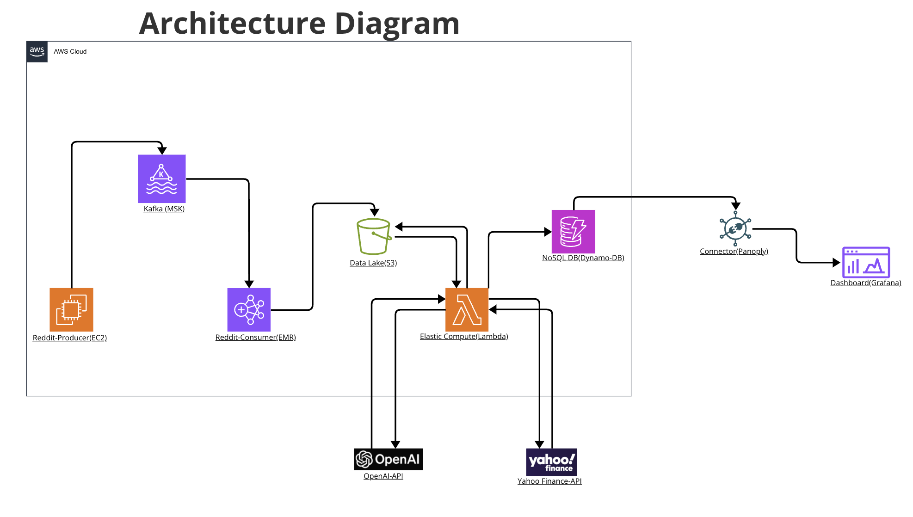
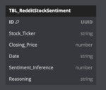
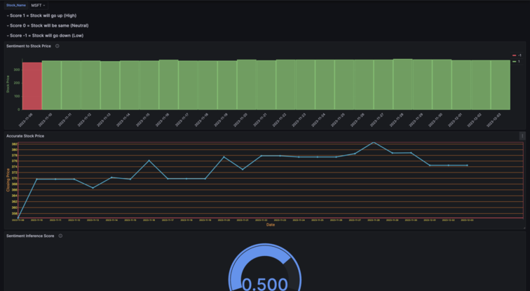

# Impact of Reddit sentiment on Stock Market

## Contributers
• Adith Rai: (Myself)
• Sai Krishna Manthena: https://github.sfu.ca/skm32
• Gitanshu: https://github.sfu.ca/gga52

The dashboard can be accessed using following credentials:
```credentials
URL: https://bidgata1.grafana.net/goto/Mc0lXqHSR?orgId=1
username: gga52@sfu.ca
password: bigdatalab1
```


## Introduction
The WallStreetBets incident of 2021 highlighted the unprecedented power of social media in influencing stock market dynamics, as a collective online community rallied behind specific stocks, triggering massive market fluctuations. This pivotal event underscored the significance of social media sentiment and its impact on stock prices, compelling us to delve deeper into the correlation between online sentiments expressed on platforms like Reddit and the subsequent fluctuations observed in the stock market. Our project seeks to analyze and understand how social media sentiment can wield substantial influence on stock market behavior.

To accomplish this, our approach involves analyzing the sentiment expressed across various subreddit communities within defined time frames and correlating these sentiments with the corresponding stock price movements. 

Analyzing text within the stock market realm poses distinctive challenges, particularly concerning sentiment analysis, diverging significantly from more conventional sentiment analysis tasks such as movie reviews. This deviation necessitates a departure from employing standard or cutting-edge pre-trained models, compelling us to devise innovative methodologies tailored specifically for the intricate nature of financial market sentiment analysis.

Despite of having several reddit-datasets,utilizing real-time Reddit data aligns with the project's objectives by offering current, authentic, and relevant information crucial for understanding the real-time impact of social media sentiment on stock market behavior.  Accomplishing this objective requires a scalable backend for data processing and a robust system capable of handling large volumes data.


## Methodolgy

### Kafka for ETL

We used Kafka, a pub/sub model for scrapping and processing data, The producer running on EC2 scrapes the data from a select number of subreddits over a specific window of time and publishes the data to `reddit-data` topic. 

The consumer uses spark-streaming to recieve data on`reddit-data` topic and does basic text-processing and loads the data into a data lake(S3).

choice of using Kafka over conventional ETL is the following

- Scalability and Flexibility: With Kafka's distributed architecture, we have the flexibility to seamlessly scale up our operations as needed. This is particularly crucial when we're dealing with large amounts of Reddit data. If we decide to widen our analysis timeframe or include additional subreddits, our current setup can handle these increased demands without compromising performance.

- Fault Tolerance and Durability: One of the great things about Kafka is its ability to replicate and safeguard data, ensuring its durability. This means that even if a part of our system fails, we won't lose any data. This is very important because every Reddit comment, especially those with high upvotes and strong sentiments, matters significantly to our analysis.

- Decoupling of Components: Kafka's architecture separates different parts of our system, making communication between them smooth and independent. This setup allows us to design our system in a more adaptable and modular way. For instance, if we want to expand our sentiment analysis to include Twitter tweets, we can easily integrate this new source by adding a producer and consumer without disrupting the entire workflow. This flexibility to expand our system seamlessly played a big role in why we chose Kafka for our project.

### Lambda architecture
The lambda is listening for new entires (consumer processed reddit data) to be created in an assigned directory in out bucket, and when ever there is a new entry, It reads the text from the data and sends API request to OpenAI along with a prompt and recieves 3 items 1) Stock ticker 2) Sentiment score 3) reasoning for the inferred score.

Lambda then sends request to yahoo finance API to fetch the price of the stock ticker along with the created date of the post and current date, To fetch stock price movement within the window. 

Lambda then sends all this information to be stored into dynamno DB. Following is the data model on DynamoDB 


 


Note: There is no date or timestamp data type in dynamoDB

We opted for Lambda functions for parallel processing and scalability, retrieving sentiment analysis from preprocessed ETL data and storing it in DynamoDB.

Lambda's serverless, event-driven design efficiently handles frequent API calls, triggered by new JSON files in our S3 bucket. Each file is processed by separate Lambda instances, ensuring fast parallel processing of Reddit data while being cost-effective, charging only for compute time.

Lambda's limitations in compute time and memory access led us to design instances to process data batches within the OpenAI API's capacity per call. Unprocessed data triggers another Lambda instance, enabling simultaneous processing across files, enhancing overall speed.

For storing processed data, DynamoDB's reliability, cost-effective model, and scalability proved ideal. Its seamless integration simplifies database infrastructure management, making it suitable for real-time, sensitive Reddit data analysis, given its scalability and support for diverse data structures.


### Dashboard
We are using Grafana dashboard to visualize the output. Grafana does not have a direct connection with DyanamoDb so we used an external connector called Panoply. 

The dashboard visualizes the price of the stock within the window and the aggregated score of the sentiment for that stock over several subreddits over the same window of time.

Grafana stands out as an ideal visualization tool for our project due to its inherent strengths in in effectively managing real-time data and offering a diverse array of visualization options. Moreover, Grafana's robustness in handling large volumes of streaming data coupled with its strong capabilities in monitoring and observability, makes it particularly well-suited for production environments. Compared to alternatives like Tableau

Additionally, its scalability and compatibility with high-volume data streams distinguish Grafana as a reliable choice for handling big data, ensuring efficient and effective visualization for our stock market analysis.


### The reason for additional Lambda layer
The decision to use a separate Lambda function for interfacing with external APIs, like OpenAI and Yahoo Finance, instead of integrating directly into the consumer process during data preprocessing, stemmed from strategic considerations. This separation enhances system scalability and resilience by safeguarding core scraping and preprocessing tasks from potential fluctuations or outages in external APIs. It ensures an efficient and robust primary data pipeline, shielded from external service variability or downtime. Using Lambda for API requests allows flexible resource allocation, independently scalable based on interaction demands. This architectural approach enables easier maintenance and updates to API code without affecting core processes. This deliberate choice aims to strengthen system reliability, scalability, and maintainability, maintaining a modular and resilient design.

## Problems
### Sentiment Model
- Initially, our pipelines integrated a pre-trained sentiment model from Facebook. However, upon comprehensive manual review of the outcomes, we determined that utilizing industry standard models would not yield favorable results within our domain. For instance, consider the following example:
    For example
    ```example
    Its a good time to sell stocks, We are upto to make a ton of money
    ```
    Conventional sentiment models would typically predict this example as having a positive label. However, within the specific context of the stock market and price movement, this statement holds a negative connotation. Selling stocks could potentially decrease the stock price, contrary to the positive sentiment inferred by the model.

- Numerous nuanced intricacies exist within the domain knowledge of stock market news and its impact on price movement. Addressing these nuances would necessitate manually labeling thousands of examples to achieve only suboptimal accuracy.

- Given the recent advancements in zero-shot learning and generative AI, leveraging Language Model (LLM) technology seemed ideally suited for our requirements. We devised a specific prompt designed to solicit sentiment scores contextualized within the stock market and its associated price movements.

- Through meticulous manual inspection of approximately 100 instances and extensive prompt engineering, we successfully developed a tailored prompt capable of eliciting the necessary response from the model, aligning with our project's objectives. This tailored approach ensures the model captures the nuanced sentiments crucial for accurate stock market analysis and price movement predictions.

### Challanges of Prompt Engineering
Navigating the complexities of Language Model (LLM) prompt engineering posed significant hurdles, primarily due to the inherent opacity of LLMs and the customized deployment of OpenAI's API. These factors imposed limitations on how effectively the prompt could be fine-tuned to elicit precise outputs.

To address this challenge, we introduced a strategic approach by requesting an additional response named "reasoning" alongside the sentiment score from the model. The inclusion of this reasoning component played a pivotal role in refining our prompt construction process. It provided invaluable insights into the model's logical deductions, elucidating how the model arrived at specific conclusions regarding a given comment within the stock market context.

Employing this reasoning feedback loop became instrumental in our iterative refinement process. We established a self-feedback mechanism aimed at enhancing the model's prompt based on the insights garnered from the responses generated by the preceding prompts. This iterative process continued iteratively until we achieved satisfactory results, effectively leveraging the model's own reasoning to refine and optimize our prompts for accurate sentiment analysis tailored to stock market dynamics.

### Batching to improve OpenAI API call performance
During the comprehensive execution of our end-to-end pipeline, we meticulously measured each step's performance, leading to the identification of the OpenAI API call as a bottleneck within the system.

To surmount this bottleneck, we embarked on a series of experiments and observed a notable discovery: the time taken by the OpenAI model to provide an inference (such as sentiment score) for a single post and multiple posts batched into a single API request was nearly identical.

Utilizing this insight, we recalibrated the prompt intended for the OpenAI API to anticipate multiple posts' text within a singular input. Our approach required the model to process each text individually within the batched input, aggregating the results and providing a consolidated response. This iterative process demanded multiple iterations of prompt modifications, introducing a specialized delimiter to distinctly separate each post within the input using a designated character.

Additionally, considering the limitation imposed by OpenAI's API on the number of tokens permissible in the input text, we developed a dedicated batch functionality. This feature intelligently collated Reddit posts close to the token limit, maximizing the batch size while staying within the token constraints. This strategic batching approach significantly minimized the total turnaround time required for predicting sentiments for a batch of n-posts, thereby optimizing the overall performance of our system's interaction with the OpenAI API. This innovative methodology not only enhanced efficiency but also ensured maximal utilization of the API's capabilities within the specified constraints.


### Custom rate limiting
Our system encountered a critical challenge due to the stringent rate limits imposed by the External APIs. Exceeding these limits resulted in receiving responses that deviated from the expected format, consequently disrupting the system's functionality.

To address this issue, we devised a strategic solution in the form of a custom Python decorator. This decorator played a crucial role in mitigating the impact of rate limits by implementing a mechanism to halt execution. Specifically, it intelligently paused the execution by invoking a sleep function until the rate limiting constraints were met, ensuring adherence to the API's official rate limits.

By implementing this custom rate limiting strategy, our system was able to maintain compliance with the API's constraints, thereby preventing disruptions caused by exceeding the prescribed call limits. This tailored approach ensured smooth and uninterrupted interactions with the External APIs, enhancing the overall robustness and reliability of our system architecture.


### Other AWS challanges.
Integrating the various AWS components and ensuring their reliable interaction presented several challenges. These challenges were further amplified by the numerous dependencies and less common libraries required by our architecture. The restrictions imposed by AWS components to ensure security, reliability and compatibility added to the time-consuming nature of the configuring the provided services.

One major challenge we encountered was setting up the MSK cluster to act as a bridge between the producer and consumer in the ETL process. Configuring Kafka to enable seamless communication between the producer and consumer required placing them in the same VPC subnet. Additionally, establishing IAM authentication with TLS encryption demanded extensive tinckering with configuration, both on the MSK Kafka cluster and the Kafka producer client in the producer source code.

On the consumer side, setting up Spark streaming with Kafka was relatively straightforward. However, configuring the EMR clusters hosting the consumer ETL process proved to be a significant learning process. To install Kafka and its dependencies on the EMR cluster, we had to create a bootstrap.sh file and store the required JAR files in an S3 path. The bootstrap.sh file would install these dependencies during cluster creation, enabling Spark to utilize Kafka. However, when cloning these bootstrapped clusters, we occasionally encountered unexpected errors. As a result, we opted to create new clusters from scratch whenever we needed the consumer to run. Once we became familiar with the process, subsequent setups became more streamlined.

The lambda component also presented challenges. Due to the architecture and the extensive functionality required from the lambda function, we relied on multiple non-native Python libraries. However, these libraries were too large to be packaged in a zip file with the handler code. 
To address this, we created lambda layers to incorporate these functionalities. However, due to the restrictions on total size allowed for a single lambda function, We were required us to gain an in-depth understanding of the internal workings of these dependency libraries. We selectively removed unused parts and strategically managed shared libraries between the dependencies. Additionally, the inability to stop a lambda function mid-execution caused undesired invocations during testing of the consumer ETL - which writes to the S3 directory that the lambda function is triggered by.

Overall, most of the challenges we encountered stemmed from initially having only a surface-level understanding of the technologies involved. As we deepened our knowledge in these areas, subsequent configurations and troubleshooting became much simpler.


### Dashboard Challanges 
Establishing a connection between a Grafana Dashboard and AWS DynamoDB posed a challenge due to the absence of a direct link between the two systems. Overcoming this hurdle required a thoughtful approach to bridge the gap between Grafana's visualization capabilities and the data stored in DynamoDB. 

In our quest to overcome the connectivity challenge between Grafana Dashboard and AWS DynamoDB, we explored diverse strategies. Initially, we pursued the creation of a CloudWatch metrics connection, establishing a bridge that linked the metrics data from DynamoDB to Grafana. Simultaneously, we ventured into the realm of ODBC Driver connections, navigating the complexities of database connectivity to forge a direct link between the two systems. Seeking a more sophisticated solution, we implemented a process involving AWS Athena. This intricate approach entailed transferring data from DynamoDB to an AWS S3 bucket and configuring AWS Athena to reference this storage, creating a direct and efficient connection to Grafana. Some approaches, like AWS Athena, proved effective but incurred high costs, while others, such as ODBC Drivers, faced challenges in creating a smooth connection for data transfer.

The optimal solution emerged with the implementation of Panoply, a Cloud Data Warehouse serving as a mediator. This streamlined process involved Panoply collecting data from DynamoDB at hourly intervals and seamlessly transmitting it to Grafana, resulting in a smooth and efficient connection for visualization.


## Results 

The project culminated in a visualization showcasing the price movements of stocks within specific timeframes, juxtaposed with aggregated sentiment analysis drawn from multiple subreddits. While the analysis did not yield perfect correlations in every instance, this outcome aligns with the complex and multifaceted nature of stock price fluctuations, influenced by a myriad of external factors. It is crucial to note that Reddit comments serve as a valuable proxy, providing valuable insights into the potential impact of social media sentiment on the dynamic landscape of the stock market.




Moreover, this project's scope extends beyond mere correlation analysis. It aims to delve deeper into understanding the collective sentiment prevailing within subreddit communities concerning specific stocks. These insights hold potential value for investors, enabling them to formulate and implement short-term trading strategies such as 'scalping,' 'day trading,' and 'swing trading' based on social sentiment indicators.

The backbone of this project lies in its backend—a scalable cloud-based architecture designed for flexibility and extensibility. This robust system operates without a single point of failure and employs asynchronous communication, ensuring reliability and adaptability. Additionally, its design allows seamless integration of additional social media signals, further enhancing its analytical capabilities for future expansions

The dashboard can be accessed using following credentials
```credentials
URL: https://bidgata1.grafana.net/goto/Mc0lXqHSR?orgId=1
username: gga52@sfu.ca
password: bigdatalab1
```


## What did you learn from the implementation?

### Prompt engineering
The project highlighted the need for customized refinements in Machine Learning (ML) models, especially in understanding nuanced sentiments across diverse domains. Standard sentiment analysis models struggled with domain-specific emotions. Our solution involved tailored prompts for accurate sentiment analysis, emphasizing the importance of domain-specific language.

Utilizing feedback from the Language Model (LLM) API provided insights into the model's decision-making, aiding iterative prompt refinement. Understanding this reasoning enhanced sentiment analysis accuracy through multiple iterations. However, dealing with Language Model complexities and OpenAI API constraints demanded innovative strategies, crucial in specialized fields like finance.

Improving system performance revealed that solely increasing resources isn't always optimal. Instead of upgrading account tiers for faster responses, we strategically batched inputs, addressing pipeline bottlenecks and external system capacities. When faced with rate limiting, implementing an internal limiter aligned with the external system proved effective. These experiences taught us strategic analysis for tailored, efficient system improvements without unnecessary resource upgrades.


### Complication of seeting up production grade AWS cloud environemnt
    
The project highlighted the challenges of creating a production-grade AWS environment, stressing meticulous planning and execution for a robust architecture handling data processing, APIs, and real-time analytics. Achieving this required deep AWS service understanding, thoughtful design, and continuous refinement.

Setting up the lambda function was tough due to dependency layers and AWS disk size limits. To address this, we optimized package size by including only necessary functionalities.

Utilizing Kafka via MSK demanded a deeper grasp of its functionality and security for a secure producer-consumer pipeline.

Running the consumer on the EMR cluster was complex, involving installing Kafka JAR files on every node, a time-consuming process during cluster creation and cloning, often leading to errors.

Despite challenges, understanding component capabilities, constraints, and integration nuances helped us navigate the complications, providing valuable insights into AWS and Cloud Technology Services.


## Summary
Getting the data (2 points):
Utilized real-time Reddit data scraping from select subreddits relevant to stock discussions.
Emphasized the significance of real-time, authentic data for understanding social media sentiment's impact on stock behavior.

ETL (3 points):
Employed Kafka for data scraping and Spark Streaming for basic text processing, feeding data into a data lake (S3).
Highlighted Kafka's scalability, fault tolerance, and decoupling advantages in managing large Reddit datasets efficiently.

Problem (2 points):
Explored the influence of social media sentiment (Reddit) on stock market behavior, prompted by the WallStreetBets incident.
Identified challenges in conventional sentiment analysis for financial markets and devised tailored methodologies for accurate analysis.

Algorithmic work (3 points):
Developed a refined sentiment analysis prompt tailored for stock market sentiment, leveraging OpenAI's Language Model.
Addressed complexities through prompt engineering, reasoning feedback loops, and innovative batching for optimal API performance.

Bigness/parallelization (3 points):
Demonstrated the scalability of the system architecture, particularly in handling extensive Reddit data and API interactions.
Innovatively optimized API performance and addressed rate limiting challenges for efficient data processing.

UI (1 points):
Utilized Grafana dashboard for visualizing stock price movements and aggregated sentiment scores across subreddits.
Focused on the significance of user-friendly visualization tools for conveying analytical results effectively.

Visualization (2 points):
Grafana's suitability for handling large streaming data and providing diverse visualization options for stock market analysis was emphasized.
Highlighted the importance of robust visualization tools in comprehending complex stock market data.

Technologies (4 points):
Leveraged Kafka, Spark Streaming, OpenAI's Language Model, AWS services (Lambda, DynamoDB, S3), and Grafana for data handling, sentiment analysis, and visualization.
Emphasized learning outcomes through the implementation of cutting-edge technologies for comprehensive data analysis in the financial domain.
